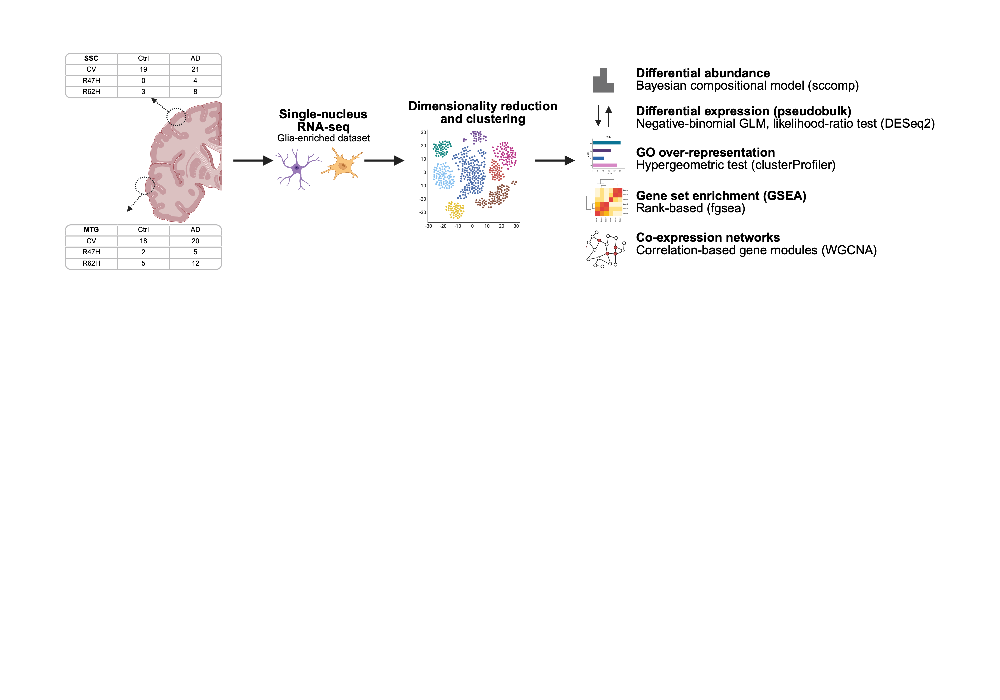

# Carriers of the TREM2 Risk Variants R47H and R62H Show Lower Astrocyte Metabolic and Proteostatic Gene Expression in Alzheimer's Disease
### An MRes Thesis Project (Biomedical Research - Data Science, Imperial College London)

## Abstract

The Alzheimer's disease risk variants TREM2 R47H and R62H are primarily studied in microglia, where TREM2 is most highly expressed. This project examined whether these variants also alter astrocyte transcriptional responses to Alzheimer's disease. The study used a glia-enriched single-nucleus RNA-sequencing dataset from post-mortem cortex, comprising 225,292 astrocyte nuclei from 70 donors stratified by neuropathological diagnosis and TREM2 genotype. Analyses included astrocyte subclustering, differential abundance, pseudobulk differential expression, Gene Ontology over-representation, gene set enrichment, variance partitioning, and co-expression network analysis. The study design and analysis workflow are summarised in Figure 1.

  

**Figure 1.** Study design and analysis workflow.
  
Input data, intermediate analysis objects, and generated results are not included in this repository. The scripts use project-specific absolute paths that must be updated before reuse.

## Analyses and Visualisation Scripts

#### Astrocyte Preprocessing and Characterisation

- **Load scFlow output into Seurat**
  - [`LD_B01_v010_load_from_scflow_TREM2_cohort_enriched.R`](LD_B_AST_analysis_scripts/LD_B01_v010_load_from_scflow_TREM2_cohort_enriched.R)

- **Astrocyte subsetting, integration, and first-round clustering**
  - Main analysis: [`LD_B02a_v010_subset_reintegrate_reclustering_tests_AST_round1.R`](LD_B_AST_analysis_scripts/LD_B02a_v010_subset_reintegrate_reclustering_tests_AST_round1.R)
  - Plotting rerun from the saved B02 object: [`LD_B02a_rerun_plotting_v010_AST_round1.R`](LD_B_AST_analysis_scripts/LD_B02a_rerun_plotting_v010_AST_round1.R)

- **Second-round astrocyte subclustering**
  - [`LD_B03a_v010_subset_reintegrate_reclustering_tests_AST_round2.R`](LD_B_AST_analysis_scripts/LD_B03a_v010_subset_reintegrate_reclustering_tests_AST_round2.R)

- **Subcluster characterisation, abundance, and pathology analyses**
  - [`LD_B04a_v036_subcluster_charact_abund_analysis_by_plaque_dens.R`](LD_B_AST_analysis_scripts/LD_B04a_v036_subcluster_charact_abund_analysis_by_plaque_dens.R)

#### Pseudobulk Differential Expression and Enrichment

- **Pseudobulk generation by astrocyte subcluster and sample**
  - [`LD_E01_v051_seur_pseudobulk_generation_min_20cells_per_pb_by_cluster.R`](LD_E_DESeq_pseudobulk_scripts/LD_E01_v051_seur_pseudobulk_generation_min_20cells_per_pb_by_cluster.R)

- **Cluster-level diagnosis and TREM2-variant differential expression**
  - Initial covariate model: [`LD_E02a2_v061_pseudobulk_DESeq2_LRT_by_clust_by_diagn_TREM2_R47H_vs_R62H_corr_APOE_CD33_BrainReg.R`](LD_E_DESeq_pseudobulk_scripts/LD_E02a2_v061_pseudobulk_DESeq2_LRT_by_clust_by_diagn_TREM2_R47H_vs_R62H_corr_APOE_CD33_BrainReg.R)
  - Five-covariate model: [`LD_E02c_v01_pseudobulk_DESeq2_LRT_by_clust_by_diagn_5covar_corr_cohort_APOE_CD33_BrainReg_Sex.R`](LD_E_DESeq_pseudobulk_scripts/LD_E02c_v01_pseudobulk_DESeq2_LRT_by_clust_by_diagn_5covar_corr_cohort_APOE_CD33_BrainReg_Sex.R)

- **Pairwise log2 fold-change comparisons and Gene Ontology analysis**
  - [`LD_E03a2_v061_DEG_characterisation_pairwise_comps_GO.R`](LD_E_DESeq_pseudobulk_scripts/LD_E03a2_v061_DEG_characterisation_pairwise_comps_GO.R)

- **Gene set enrichment analysis**
  - Initial model: [`LD_E03b2_v061_DEG_characterisation_GSEA_with_in_vitro.R`](LD_E_DESeq_pseudobulk_scripts/LD_E03b2_v061_DEG_characterisation_GSEA_with_in_vitro.R)
  - Five-covariate model: [`LD_E03c_GSEA_5covar.R`](LD_E_DESeq_pseudobulk_scripts/LD_E03c_GSEA_5covar.R)

- **Incremental covariate-adjustment analysis**
  - [`LD_E04a_v01_incremental_covar_adj_log2FC_corr_sel_comps.R`](LD_E_DESeq_pseudobulk_scripts/LD_E04a_v01_incremental_covar_adj_log2FC_corr_sel_comps.R)

#### Co-expression Network Analysis

- **Pseudobulk generation for the WGCNA workflow**
  - [`LD_F01_v060_seur_pseudobulk_generation_min_20cells_per_pb_by_cluster.R`](LD_F_DESeq_pseudobulk_WGCNA_scripts/LD_F01_v060_seur_pseudobulk_generation_min_20cells_per_pb_by_cluster.R)

- **Combined-across-cluster differential expression**
  - Initial model: [`LD_F02a1_v060_pseudobulk_DESeq2_LRT_comb_AD_TREM2_R62H_by_diagn_corr_APOE_CD33_Region_low_p_cutoff.R`](LD_F_DESeq_pseudobulk_WGCNA_scripts/LD_F02a1_v060_pseudobulk_DESeq2_LRT_comb_AD_TREM2_R62H_by_diagn_corr_APOE_CD33_Region_low_p_cutoff.R)
  - Seven-covariate, both-variant model: [`LD_F02c_v01_pseudobulk_DESeq2_LRT_comb_AD_both_variants_7covar_corr_cohort_APOE_CD33_Region_Sex_PMI_libsize.R`](LD_F_DESeq_pseudobulk_WGCNA_scripts/LD_F02c_v01_pseudobulk_DESeq2_LRT_comb_AD_both_variants_7covar_corr_cohort_APOE_CD33_Region_Sex_PMI_libsize.R)

- **Weighted gene co-expression network analysis**
  - Initial network: [`LD_F03a1_v060_DEG_charact_WGCNA_TREM2_R62H_by_diagn_corr_APOE_CD33_Region_low_p_cutoff.R`](LD_F_DESeq_pseudobulk_WGCNA_scripts/LD_F03a1_v060_DEG_charact_WGCNA_TREM2_R62H_by_diagn_corr_APOE_CD33_Region_low_p_cutoff.R)
  - Both-variant, DEG-seeded network: [`LD_F03c_v02_WGCNA_AD_both_variants_7covar_corr_DEGseed.R`](LD_F_DESeq_pseudobulk_WGCNA_scripts/LD_F03c_v02_WGCNA_AD_both_variants_7covar_corr_DEGseed.R)
  - Pathology-adjustment robustness analysis: [`LD_F03d_v01_WGCNA_AD_DEGseed_pathology_robustness.R`](LD_F_DESeq_pseudobulk_WGCNA_scripts/LD_F03d_v01_WGCNA_AD_DEGseed_pathology_robustness.R)

- **TREM2 variance explained within WGCNA Gene Ontology terms**
  - [`LD_F04c_v01_TREM2varExpl_per_v02_WGCNA_GO_term.R`](LD_F_DESeq_pseudobulk_WGCNA_scripts/LD_F04c_v01_TREM2varExpl_per_v02_WGCNA_GO_term.R)

#### Variance Partitioning

- **Genome-wide pseudobulk variance partitioning**
  - [`LD_H01_pseudobulk_varPart_mixed_model.R`](LD_H_VarPartition_scripts/LD_H01_pseudobulk_varPart_mixed_model.R)

- **Characterisation of genes with variance explained by TREM2 genotype**
  - [`LD_H02_pseudobulk_varPart_var_genes_char_corr_tech_bio_vars.R`](LD_H_VarPartition_scripts/LD_H02_pseudobulk_varPart_var_genes_char_corr_tech_bio_vars.R)

- **WGCNA of TREM2-driven variable genes**
  - [`LD_H03_varPart_char_WGCNA_corr_tech_bio_vars_TREM2_thr0.05.R`](LD_H_VarPartition_scripts/LD_H03_varPart_char_WGCNA_corr_tech_bio_vars_TREM2_thr0.05.R)

#### Microglia-Astrocyte Communication Analysis

- **Merge astrocyte and microglial inputs**
  - Pseudobulk objects: [`LD_G01a_AST_MIC_pseudobulk_merge.R`](LD_G_MIC_AST_communication_analysis/LD_G01a_AST_MIC_pseudobulk_merge.R)
  - Seurat objects: [`LD_G01b_v001_AST_MIC_seurat_merge.R`](LD_G_MIC_AST_communication_analysis/LD_G01b_v001_AST_MIC_seurat_merge.R)

- **CellChat inference**
  - Ungrouped: [`LD_G02a_ungrouped_DEG_filter_cellchat_analysis_MIC_AST.R`](LD_G_MIC_AST_communication_analysis/LD_G02a_ungrouped_DEG_filter_cellchat_analysis_MIC_AST.R)
  - By TREM2 variant: [`LD_G02b_by_TREM2_variant_DEG_filter_cellchat_analysis_MIC_AST.R`](LD_G_MIC_AST_communication_analysis/LD_G02b_by_TREM2_variant_DEG_filter_cellchat_analysis_MIC_AST.R)
  - By TREM2 variant and diagnosis: [`LD_G02c_by_TREM2variantXdiagnosis_DEG_filter_cellchat_analysis_MIC_AST.R`](LD_G_MIC_AST_communication_analysis/LD_G02c_by_TREM2variantXdiagnosis_DEG_filter_cellchat_analysis_MIC_AST.R)

- **CellChat visualisation and comparison**
  - Ungrouped: [`LD_G03a_visualisation_ungrouped_cellchat_analysis_MIC_AST.R`](LD_G_MIC_AST_communication_analysis/LD_G03a_visualisation_ungrouped_cellchat_analysis_MIC_AST.R)
  - By TREM2 variant: [`LD_G03b_visualisation_byTREM2variant_cellchat_analysis_MIC_AST.R`](LD_G_MIC_AST_communication_analysis/LD_G03b_visualisation_byTREM2variant_cellchat_analysis_MIC_AST.R)
  - By TREM2 variant and diagnosis: [`LD_G03c_visualisation_byTREM2variantXdiagnosis_cellchat_analysis_MIC_AST.R`](LD_G_MIC_AST_communication_analysis/LD_G03c_visualisation_byTREM2variantXdiagnosis_cellchat_analysis_MIC_AST.R)
  - Pairwise comparisons in Alzheimer's disease: [`LD_G03d_CellChat_comparison.R`](LD_G_MIC_AST_communication_analysis/LD_G03d_CellChat_comparison.R)

The communication workflow also requires the corresponding microglial Seurat, pseudobulk, and differential-expression objects, which are not included in this repository.

#### Thesis Tables and Figures

- **Cohort summary tables**
  - [`LD_X01_cohort_summary_tables.R`](LD_X_Thesis_Presentatioon_Figures_scripts/LD_X01_cohort_summary_tables.R)

- **Overview and clustering figures**
  - Overview UMAPs: [`LD_X02_overview_UMAP_figure.R`](LD_X_Thesis_Presentatioon_Figures_scripts/LD_X02_overview_UMAP_figure.R)
  - Resolution and integration QC UMAPs: [`LD_X03_supp_resolution_QC_UMAPs.R`](LD_X_Thesis_Presentatioon_Figures_scripts/LD_X03_supp_resolution_QC_UMAPs.R)

- **Astrocyte characterisation, abundance, and pathology figures**
  - Characterisation plots: [`LD_X04_B_characterisation_plots.R`](LD_X_Thesis_Presentatioon_Figures_scripts/LD_X04_B_characterisation_plots.R)
  - Abundance plots: [`LD_X05_abundance_plots.R`](LD_X_Thesis_Presentatioon_Figures_scripts/LD_X05_abundance_plots.R)
  - Pathology analysis: [`LD_X06_pathology_analysis.R`](LD_X_Thesis_Presentatioon_Figures_scripts/LD_X06_pathology_analysis.R)

- **Differential-expression and pathway figures**
  - Pseudobulk DESeq2 figures: [`LD_X07_pseudobulk_DESeq2_figures_5covar.R`](LD_X_Thesis_Presentatioon_Figures_scripts/LD_X07_pseudobulk_DESeq2_figures_5covar.R)
  - Pooled astrocyte-family GO analysis: [`LD_X08_GO_quadrants_family_pooled_5covar.R`](LD_X_Thesis_Presentatioon_Figures_scripts/LD_X08_GO_quadrants_family_pooled_5covar.R)
  - Interferon Hallmark dot plots: [`LD_X09_IFN_hallmark_dotplots.R`](LD_X_Thesis_Presentatioon_Figures_scripts/LD_X09_IFN_hallmark_dotplots.R)
  - GSEA heatmap replotting: [`LD_X10_GSEA_heatmap_largest7_replot.R`](LD_X_Thesis_Presentatioon_Figures_scripts/LD_X10_GSEA_heatmap_largest7_replot.R)

The X07-X09 scripts require a precomputed `LD_E04c_bulk_data.qs` object. The script that generated this object is not included in the repository.

## Reproducibility

- Analyses were run in R on the Imperial College HPC service.
- The PBS submission wrapper is provided in [`qsub_cx3_R_R43_240426_1c32g8h.sh`](qsub_cx3_R_R43_240426_1c32g8h.sh). It loads Miniforge and activates the `R43_240426` environment.
- Package requirements are declared through `library()` calls within each script. No package lockfile is included.
- Random seeds are set within scripts where stochastic procedures are used.
- Most analysis scripts record `sessionInfo()` in their job output.
